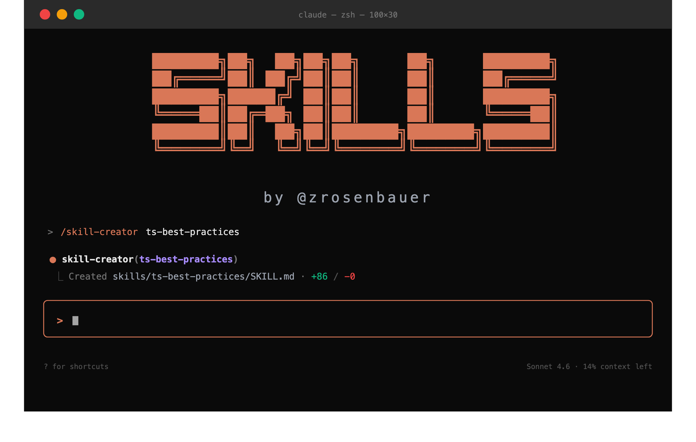

<p align="center">
  
</p>

<p align="center">
  <a href="https://skills.sh/zrosenbauer/skills"></a>
  <a href="./LICENSE"></a>
</p>

A curated collection of [agent skills](https://skills.sh) for AI coding assistants — pressure-tested for TypeScript reviews, refactors, skill authoring, and cross-agent portability.

Skills are `SKILL.md` files that tell an AI agent **when** and **how** to do something. They're agent-agnostic — drop them into Claude Code, Cursor, Codex, or any tool that supports the [skills.sh](https://skills.sh) format.

## Install

```bash
# every skill
npx skills add zrosenbauer/skills

# just one
npx skills add zrosenbauer/skills --skill ts-best-practices
```

The [`skills` CLI](https://www.npmjs.com/package/skills) handles discovery and placement for your agent.

## Skills

| # | Skill | What it does | Install |
| --- | --- | --- | --- |
| 1 | [`code-reviewer`](./skills/code-reviewer) | Adversarial review of a diff or PR — finds real issues, not nits | `npx skills add zrosenbauer/skills --skill code-reviewer` |
| 2 | [`ts-best-practices`](./skills/ts-best-practices) | Writing or refactoring TypeScript with idiomatic patterns | `npx skills add zrosenbauer/skills --skill ts-best-practices` |
| 3 | [`ts-best-practices-functional`](./skills/ts-best-practices-functional) | Refactoring TS toward functional patterns — Result types, no mutation | `npx skills add zrosenbauer/skills --skill ts-best-practices-functional` |
| 4 | [`skill-creator`](./skills/skill-creator) | Authoring a new skill with the RED→GREEN eval cycle baked in | `npx skills add zrosenbauer/skills --skill skill-creator` |
| 5 | [`skill-eval`](./skills/skill-eval) | Re-running baselines on existing skills after a model upgrade | `npx skills add zrosenbauer/skills --skill skill-eval` |
| 6 | [`skill-portability`](./skills/skill-portability) | Checking whether a skill works across Claude Code, Cursor, Codex, etc. | `npx skills add zrosenbauer/skills --skill skill-portability` |

Each skill ships its own `SKILL.md` and `evals.json` under [`skills/<name>/`](./skills).

> **Discover more skills** → browse the leaderboard at [skills.sh](https://skills.sh) — top-installed agent skills across the ecosystem (vercel-labs, anthropics, microsoft, remotion, …).

## Compatibility

Targets the [skills.sh](https://skills.sh) `SKILL.md` spec — works with any compliant agent:

- **Claude Code** — full support, including extended frontmatter (`argument-hint`, `user-invocable`, `model-invocable`)
- **Cursor**, **OpenAI Codex CLI**, **Gemini CLI**, **OpenCode**, **Pi** — supported via the universal `name` + `description` core
- **Custom agents** — anything that loads `SKILL.md` files

## Why pressure-tested?

Every public skill ships with an `evals.json` — at least three realistic scenarios with deterministic assertions. Each skill has been proven to:

1. Solve a real failure mode the underlying model gets wrong by default (RED baseline)
2. Reliably correct that failure once the skill is loaded (GREEN run)

No vibes-based skills. If it's published here, it's been graded.

## Contributing

Want to add a skill, fix a bug, or fork one for your own use? See [CONTRIBUTING.md](./CONTRIBUTING.md) for the dev setup, skill authoring workflow, and conventions.

## License

[MIT](./LICENSE) © Zac Rosenbauer
